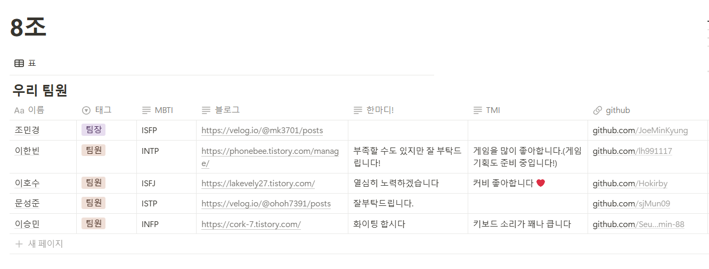

# 뉴스피드 PJ

## 서비스가 달성하고자 하는 목표
인스타그램, 트위터, 페이스북 등과 같이 sns서비스에서 사용자가 CRUD할 수 있고, 친구의 최신 게시물을 뉴스피드로 자유롭게 볼 수 있도록 하며, 사용자 간의 소통과 정보 공유를 원활하게 하는것이 목표입니다.
이를 통해 사용자들이 서로의 일상을 공유하고, 더 나아가  댓글을 통해 정보와 감정을 교류하며, 나아가 플랫폼 내에서 자연스럽게 커뮤니티가 활성화되어 사용자 경험과 참여도를 극대화하는 시너지를 창출하기 위해 서비스를 개발하게 되었습니다.

## 핵심 기능 소개

Jwt 적용한 로그인 및 댓글, 게시물 CRUD 기능  
헤당 프로젝트의 서비스는 JWT 기반 인증 시스템을 도입하였으며, 클라이언트가 안전하게 로그인하고, 발급받은 토큰을 통해 보호된 API에 접근할 수 있도록 구현했습니다. 
 이를 기반으로 사용자는 게시물과 댓글에 대해 CURD를 수행할 수 있습니다.  
 특히, 게시물과 댓글 수정/삭제 기능은 해당 콘텐츠의 작성자만이 접근할 수 있도록 권한 검증 로직을 포함하여 보안을 강화했습니다.  
 이와 더불어, 좋아요 및 프로필 기능을 통해 사용자 간의 원활한 소통과 커뮤니티 활성화를 지원하여, 서비스의 전반적인 사용자 경험과 참여도를 극대화하였습니다. 
 JWT를 활용한 인증 및 권한 관리는 서버의 상태 관리 부담을 줄이는 동시에 확장성과 보안성을 확보하는 데 큰 역할을 하고 있습니다.

[0. 팀과 팀원 소개](#0-팀과-팀원-소개)
[1. 개발환경](#1-개발환경)
[2. 요구사항](#2-요구사항)
[3. 설계구조](#3-설계구조)
[4. 업데이트 진행](#4-업데이트-진행)

### 0. 팀과 팀원 소개

#### 조이름

팀 이름 : 8ameter(미정)
뜻 : (미정)

#### 팀장

조민경 https://github.com/JoeMinKyung

#### 팀원

이한빈 https://github.com/lh991117 
문성준 https://github.com/sjMun09 
이승민 https://github.com/Seung-min-88 
이호수 https://github.com/Hokirby

#### 커밋규칙

[commitRules](newspeed/image/commitRules.png)

### 1. 개발환경

- spring Boot 3.4.2
- Mysql 8.0.32
- JPA
- JWT

### 2. 요구사항

#### 필수기능

1. 프로필 관리
+ 프로필 조회 기능 
+ 프로필 수정 기능
  + 로그인한 사용자는 본인의 사용자 정보를 수정할 수 있다
  + 비밀번호 수정 조건
  1. 비밀번호 수정 시, 본인 확인을 위해 현재 비밀번호를 입력하여 올바른 경우에만 수정할 수 있다
  2. 현재 비밀번호와 동일한 비밀번호로는 수정할 수 없다
  + 조건 만족하지 않는 경우와 비밀번호 형식이 올바르지 않은 경우 예외처리

2. 뉴스피드 게시물 관리
+ 게시물 작성, 조회, 수정, 삭제 기능
+ 게시물 수정, 삭제 조건
  + 작성자 본인만 처리할 수 있다
  + 직성자가 아닌 다른 사용자가 게시물 수정, 삭제 시도할 경우 예외처리
+ 뉴스피드 조회 기능
  + 기본 정렬은 생성일자 기준으로 내림차순 정렬
  + 10개씩 페이지네이션, 각 페이지 당 뉴스피드 데이터가 10개씩 나오게 함

3. 사용자 인증
+ 회원가입 기능
  + 사용자 아이디: email 형식
  + 비밀번호: Bycrypt 로 인코딩
  + 비밀번호 조건: 대소문자 포함 영문 + 숫자 + 특수문자를 최소 1글자씩 포함, 최소 8글자 이상
  + 예외처리: 중복된 사용자 아이디로 가입하는 경우, 이메일과 비밀번호 형식이 올바르지 않은 경우
+ 회원탈퇴 기능
  + 탈퇴 처리 시 비밀번호를 확인한 후 일치할 때 탈퇴 처리
  + 탈퇴한 사용자의 아이디는 재사용할 수 없고, 복구할 수 없다
  + 예외처리: 사용자 아이디와 비밀번호가 일치하지 않는 경우, 이미 탈퇴한 사용자 아이디인 경우
+ 친구 관리
  + 특정 사용자를 친구로 추가/삭제할 수 있다
  + 친구 기능이 구현되면 뉴스피드에 친구의 최신 게시물들을 최신순으로 볼 수 있다
  + 상대방의 수락 기능이 필요하다

#### 도전기능

1. 뉴스피드 정렬
+ 수정일자 기준 최신순
+ 좋아요 많은 순
+ 기간별 검색 기능

2. 댓글
+ 댓글 작성, 조회, 수정, 삭제
+ 사용자는 게시물에 댓글을 작성할 수 있고, 본인의 댓글을 수정 및 삭제할 수 있다
+ 댓글 수정시 내용만 수정 가능하다
+ 댓글 삭제는 댓글 작성자와 게시글 작성자만 가능하다
+ 댓글 수정은 댓글의 작성자만 가능하다

3. 좋아요
+ 게시물 및 댓글 좋아요/좋아요 취소 기능
+ 사용자가 게시물이나 댓글에 좋아요를 남기거나 취소할 수 있다
+ 본인이 작성한 게시물과 댓글에 좋아요를 남길 수 없다
+ 같은 게시물에는 사용자 당 한번만 좋아요가 가능하다

### 3. 설계구조

#### 코드 구조

프로젝트 구조 이미지와 설명

#### 운영 환경 구조

##### ERD

API 명세서 이미지와 설명, 노션링크

#### 상세 기능

와이어 프레임 이미지와 화면 단위 설명

### 4. 업데이트 진행

주요 commit 정리

### 5. 트러블 슈팅
문성준 : https://velog.io/@ohoh7391/%EB%89%B4%EC%8A%A4%ED%94%BC%EB%93%9C-PJ-%ED%8A%B8%EB%9F%AC%EB%B8%94-%EC%8A%88%ED%8C%85  
이한빈 : https://phonebee.tistory.com/76   
조민경 : https://github.com/newspeed8/newspeed/commit/1959fe619529cee3ccc05d5289d02a3371bf40d7   
이승민 : https://github.com/newspeed8/newspeed/commit/4420821880a2c54a90cd82602dcc10a888c10f67   
이호수 :   

### 6. 소감
#### 문성준 
저는 JWT와 게시물 관리 영역을 구현하면서, 기존 세션 기반 방식에서 벗어나 보다 확장성과 보안성이 뛰어난 토큰 기반 인증 방식을 경험할 수 있었습니다. 
특히, Spring Security의 필터 체인과 SecurityContext를 활용하는 방법을 익히면서, 인증과 권한 관리에 대한 이해도가 크게 향상되었습니다.  
전반적으로 코드 리팩토링과 JWT 적용 과정은 도전적이었지만, 결과적으로 해당 프로젝트의 서비스 안정성과 확장성을 높이는 데 큰 도움이 되었다고 느낍니다. 
실제로 JWT 기반 인증을 구현하는 과정에서 Spring Security의 필터 체인과 SecurityContext가 내부적으로 활용되고 있으며, 
제가 작성한 코드는 (JwtAuthenticationFilter는 OncePerRequestFilter를 상속받아 )모든 HTTP 요청마다 JWT를 추출하고 검증하며, 유효한 토큰이 있을 경우 SecurityContextHolder에 인증 정보를 설정하도록 구현되었습니다. 
이 과정이 바로 Spring Security의 핵심 메커니즘을 활용하는 것이며, 이를 통해 Spring Security의 내부 작동 원리를 더욱 깊이 이해할 수 있었습니다.  
#### 이한빈
이번 팀 프로젝트를 통해서 Spring boot에 대해 좀 더 자세히 알 수 있었고, 전보다 CRUD 제작을 빠르고 정교하게 할 수 있도록 발전했던 시간이였습니다.  
특히 Spring boot를 통한 첫 팀 프로젝트였다 보니 개인 과제를 진행했을 때 보다, 훨씬 쉽고 빠르게 작성할 수 있었고, 다른 팀원이 작성한 코드들을 보면서 저의 코드들을 보완하고 수정할 수 있어서 백앤드 개발자로서 좀 더 성장했다는 느낌을 받았습니다
#### 조민경
뉴스피드 프로젝트를 통해 많은 것을 배울 수 있었다.  
특히, 인증 시스템과 사용자 상호작용 기능을 결합하는 과정에서 기술적인 도전이 많았고, 이를 해결하면서 실제 서비스의 성능과 보안을 동시에 고려해야 함을 실감했다.  
또한 좋아요 부분은 구현해본 적이 없었기에 처음으로 새롭게 구현해보는 도전적인 경험이었다.  
앞으로 이 경험을 바탕으로 더 많은 기능을 확장하거나 개선할 수 있는 자신감을 얻었다.
#### 이승민 
팀 프로젝트를 통해 개인과제에서 생각하지 못했던 다양한 부분을 함께 작성하고 공유하여 배우는 좋은 계기가 되었고, 실력에 많은 도움이 되었던 프로젝트였습니다. 
여러 기능을 연관관계로 묶는 과정에서 생기는 오류와 예외를 처리하는 과정에서 처음 써보는 로직을 사용해 발전 할 수 있는 시간이였습니다.
#### 이호수

### 7. 기술적으로 새롭게 배운 것에 대한 설명

#### 문성준
기존 세션 기반 인증 대신 JWT를 사용하여 인증/인가 로직을 전환하는 방법을 학습했습니다.  
 이를 통해 로그인 시 서버가 상태 정보를 유지하지 않고도, 클라이언트가 발급받은 토큰을 이용해 보호된 API에 접근할 수 있다는 것을 알게되었으며,  
 Spring Security와 JJWT 라이브러리를 활용하여 토큰 생성, 검증, 그리고 SecurityContext에 인증 정보를 설정하는 과정에서 에러를 자주 만나 jwt를 더욱 자세히 익혔습니다. 

#### 이한빈
JWT 기반 인증/인가 기능을 처음 사용했습니다. JWT 기능을 사용했을 때 session은 서버에 세션 정보를 저장 했어야했지만, 
 JWT는 클라이언트에서 인증을 유지할 수 있어서 확장성이 우수하다는 것을 알 수 있었습니다. 
 특히 JWT는 DB조회 없이 사용할 수 있다고 하여, 안정성도 우수하다는 것을 알 수 있었습니다.

#### 조민경
이번 프로젝트를 통해 JWT (JSON Web Token) 기반 인증을 새롭게 배웠다.  
이전에는 세션 기반 인증을 사용했으나, JWT를 사용하면 서버에 세션 정보를 저장할 필요 없이 클라이언트 측에서 인증을 유지할 수 있어 성능과 확장성 면에서 장점이 있었다. 
JWT 토큰을 발급하고 검증하는 과정, 토큰을 HTTP 헤더를 통해 주고받는 방식 등을 구현하며 보안적인 측면과 함께 인증 체계의 효율성을 이해할 수 있었다.  

#### 이승민

#### 이호수

